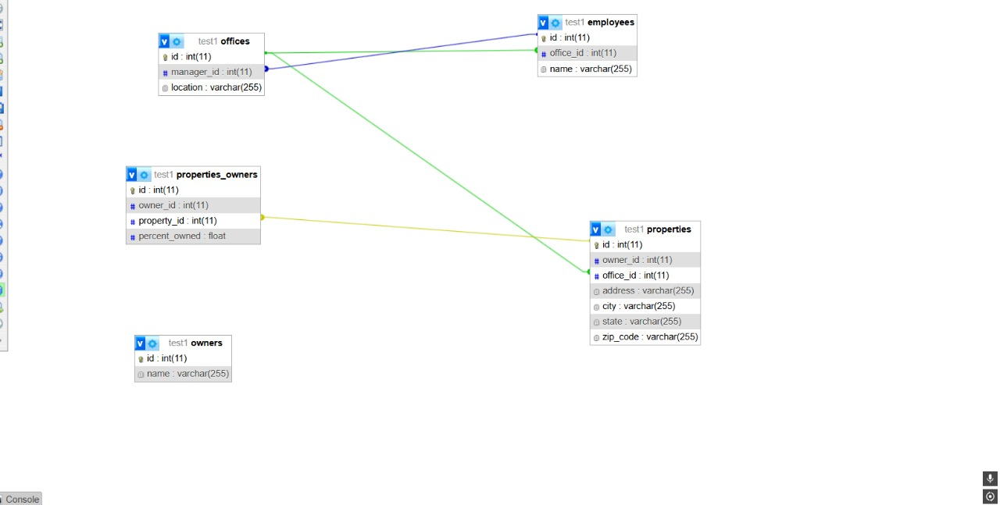
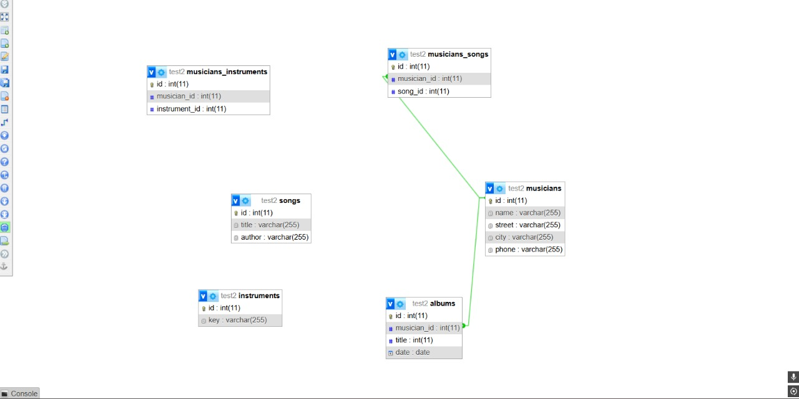

## Sales Office Database (Designer tab)



## Musicana Database (Designer tab)



## Musicana Database (SQL)

```SQL
CREATE DATABASE `musicana`;

use `musicana`;

CREATE TABLE `musicians` (
  `id` integer PRIMARY KEY,
  `name` varchar(255),
  `street` varchar(255),
  `city` varchar(255),
  `phone` varchar(255)
);

CREATE TABLE `albums` (
  `id` integer PRIMARY KEY,
  `musician_id` integer,
  `title` integer,
  `date` date
);

CREATE TABLE `instruments` (
  `id` integer PRIMARY KEY,
  `key` varchar(255)
);

CREATE TABLE `songs` (
  `id` integer PRIMARY KEY,
  `title` varchar(255),
  `author` varchar(255)
);

CREATE TABLE `musicians_songs` (
  `id` integer PRIMARY KEY,
  `musician_id` integer,
  `song_id` integer
);

---

CREATE TABLE `musicians_instruments` (
  `id` integer PRIMARY KEY,
  `musician_id` integer,
  `instrument_id` integer
);

ALTER TABLE `albums`
  ADD FOREIGN KEY (`musician_id`) REFERENCES `musicians` (`id`);

ALTER TABLE `musicians_songs`
  ADD FOREIGN KEY (`musician_id`) REFERENCES `musicians` (`id`),
  ADD FOREIGN KEY (`song_id`) REFERENCES `songs` (`id`);

ALTER TABLE `musicians_instruments`
  ADD FOREIGN KEY (`musician_id`) REFERENCES `musicians` (`id`),
  ADD FOREIGN KEY (`instrument_id`) REFERENCES `instruments` (`id`);
```
